# ☸️ Awesome Managed Kubernetes Services (EKS, GKE, AKS & Open-Source K8s) 🚀

    

A curated directory of **Commercial Managed Kubernetes Platforms (SaaS)** 🌐 and **Open-Source Kubernetes Ecosystem Projects** 🛠️. This guide covers top-tier cloud services, self-hosted Kubernetes distributions, cluster operations, control plane pricing 💰, free tier limits 🎁, company valuations 📈, and open-source GitHub Stars_Counts ⭐.

---

## 📋 Table of Contents
- [📊 Market Landscape & Sector Analysis](#-market-landscape--sector-analysis)
- [☁️ Managed Kubernetes SaaS Platforms](#️-managed-kubernetes-saas-platforms)
- [🔓 Open-Source Kubernetes Projects](#-open-source-kubernetes-projects)
- [🤝 How to Contribute](#-how-to-contribute)
- [💖 Support & Sponsorship](#-support--sponsorship)
- [📈 Star History](#-star-history)
- [⚠️ Disclaimer](#️-disclaimer)

---

## 📊 Market Landscape & Sector Analysis

> 💡 **Estimated Market Size:** The global Managed Kubernetes & Container Management market is estimated at **\$2.5B–\$3.2B in 2026** and projected to exceed **\$6.5B by 2030** (CAGR ~23–25%).
> 
> 🏆 **Market Fragmentation:** The managed Kubernetes sector is **highly concentrated (winner-take-most)** around the top hyper-scalers (**AWS EKS, GCP GKE, Azure AKS**), which collectively hold over 70% of production enterprise deployments. However, a **moderately fragmented long-tail market** exists for developer-focused cloud providers (DigitalOcean, Linode/Akamai, Civo, Vultr) and enterprise hybrid/multi-cluster management suites (Red Hat OpenShift, SUSE Rancher, VMware Tanzu).

---

## ☁️ Managed Kubernetes SaaS Platforms

Below is a comparison of leading managed Kubernetes services, sorted in descending order by **Company Size / Revenue / Valuation** 🏢.

| Managed Service 🚀 | Platform Description 📝 | Starting Tier Price 💳 | Free Tier / Trial Limits 🎁 | Company Size / Valuation / Revenue 💰 |
| :--- | :--- | :--- | :--- | :--- |
| **[Amazon EKS](https://aws.amazon.com/eks/)** | Managed Kubernetes control plane by AWS with automatic scaling, VPC integration, and EKS Auto Mode. | \$0.10/hour per cluster (~\$73/month control plane) + EC2/Fargate worker compute | No free control plane. AWS Free Tier offers 750 hrs/month t2.micro/t3.micro for 12 months (compute only). | **Market Cap: ~\$2.2 Trillion** (Amazon.com Inc., AWS Annual Revenue ~\$100B+) |
| **[Google Kubernetes Engine (GKE)](https://cloud.google.com/kubernetes-engine)** | Original managed K8s service with Autopilot mode, multi-cluster Enterprise management, and zonal redundancy. | \$0.10/hour per cluster (~\$73/month control plane) + Compute Engine worker nodes | **\$74.40/month free credit** (covers 1 zonal/Autopilot control plane forever) + \$300 90-day free trial credit. | **Market Cap: ~\$2.0 Trillion** (Alphabet Inc., Google Cloud Annual Revenue ~\$33B+) |
| **[Azure Kubernetes Service (AKS)](https://azure.microsoft.com/en-us/products/kubernetes-service/)** | Microsoft enterprise K8s integrated with Entra ID, Azure Monitor, and Azure Policy. | **\$0.00/hour** for standard Free control plane tier (\$0.10/hr for Uptime SLA Standard tier) + VM compute | **Free control plane forever** (Free Tier without SLA). New users get **\$200 credit for 30 days** + 12 months free popular services. | **Market Cap: ~\$3.1 Trillion** (Microsoft Corp., Azure Annual Revenue ~\$60B+) |
| **[Broadcom / VMware Tanzu](https://tanzu.vmware.com/mission-control)** | Enterprise multi-cluster Kubernetes management, governance, and policy control across hybrid clouds. | Sales-led custom subscription bundle (VMware Cloud Foundation / VVF core-based licensing) | No free control plane tier; **30-day enterprise evaluation / demo trial** upon sales approval. | **Market Cap: ~\$800 Billion** (Broadcom Inc. / VMware parent) |
| **[Linode Kubernetes Engine (LKE)](https://www.linode.com/products/kubernetes/)** | Akamai's developer-friendly managed K8s with fast provisioning and LKE Enterprise GitOps integration. | **\$0.00/hour** for standard control plane (\$60/month for High Availability option) + Linode node compute | **Free control plane forever**. New accounts receive **\$100 promotional credit for 60 days**. | **Market Cap: ~\$15 Billion** (Akamai Technologies Inc., Annual Revenue ~\$3.8B) |
| **[Red Hat OpenShift](https://www.redhat.com/en/technologies/cloud-computing/openshift)** | Enterprise hybrid cloud Kubernetes platform with integrated CI/CD, monitoring, security, and ROSA/ARO offerings. | \$0.171/hour per 4 vCPUs (On-Demand ROSA/OpenShift Dedicated) or \$0.076/hr (3-yr reserved) + cloud infrastructure | **60-day free trial** of Red Hat OpenShift Dedicated / Self-Managed cluster via Red Hat Hybrid Cloud Console. | **Valuation: ~\$34 Billion** (Acquired by IBM; IBM Market Cap ~\$200B) |
| **[DigitalOcean Managed Kubernetes](https://www.digitalocean.com/products/kubernetes/)** | Simple, developer-centric managed Kubernetes with straightforward pricing and automated maintenance. | **\$0.00/hour** for standard control plane (\$40/month for High Availability option) + Droplet worker compute | **Free control plane forever**. New signups receive **\$200 credit valid for 60 days**. | **Market Cap: ~\$3.5 Billion** (DigitalOcean Holdings Inc., Annual Revenue ~\$700M+) |
| **[Rancher Prime](https://www.rancher.com/)** | Commercial enterprise Rancher platform by SUSE providing multi-cluster management, NeuVector security, and SLA support. | Sales-led custom pricing (vCPU/core-based annual subscription tiers) | Community Rancher OS is free. Rancher Prime offers a **30-day enterprise trial / POC evaluation**. | **Valuation: ~\$2.8 Billion** (SUSE / EQT Private Equity) |
| **[Vultr Kubernetes Engine (VKE)](https://www.vultr.com/kubernetes/)** | Global managed K8s spanning 32+ data centers with high-performance worker nodes and free control plane. | **\$0.00/hour** for control plane + Vultr Cloud Compute worker instances | **Free control plane forever**. New accounts receive **\$200–\$300 promo credit valid for 30 days**. | **Estimated Valuation: ~\$1.5 Billion** (Privately held, Constant / Vultr) |
| **[Civo Cloud](https://www.civo.com/)** | Ultra-fast developer Kubernetes powered by K3s, providing ~90-second cluster provisioning times. | **\$0.00/hour** for control plane + worker instances starting at ~\$0.007/hour (\$5/month) | **Free control plane forever**. New users receive **\$250 free credit valid for 30 days**. | **Estimated Valuation: ~\$100 Million** (Privately held, backed by THG / venture investors) |

---

## 🔓 Open-Source Kubernetes Projects

The open-source ecosystem provides the foundation for container orchestration, cluster lifecycle management, lightweight distributions, and operator tooling. 

Projects below are sorted in descending order by **GitHub Stars_Count** ⭐.

| Project 📦 | Description 📝 | License 📜 | GitHub_Stars ⭐ |
| :--- | :--- | :--- | :--- |
| **[Kubernetes](https://github.com/kubernetes/kubernetes)** | The de facto container orchestration platform and foundation for all managed Kubernetes services. | Apache-2.0 |  |
| **[Prometheus](https://github.com/prometheus/prometheus)** | The CNCF cloud-native monitoring system and time-series database standard for Kubernetes clusters. | Apache-2.0 |  |
| **[K9s](https://github.com/derailed/k9s)** | Terminal UI for interacting with Kubernetes clusters, providing real-time resource monitoring and management. | Apache-2.0 |  |
| **[K3s](https://github.com/k3s-io/k3s)** | Lightweight, CNCF-certified Kubernetes distribution packaged as a single <100MB binary, optimized for edge & IoT. | Apache-2.0 |  |
| **[Minikube](https://github.com/kubernetes/minikube)** | Local Kubernetes engine designed for development workflows, supporting multi-node and multi-driver environments. | Apache-2.0 |  |
| **[Helm](https://github.com/helm/helm)** | The package manager for Kubernetes, enabling declarative application packaging via Helm Charts. | Apache-2.0 |  |
| **[Rancher](https://github.com/rancher/rancher)** | Complete multi-cluster Kubernetes management platform for provisioning, security governance, and cluster operations. | Apache-2.0 |  |
| **[Cilium](https://github.com/cilium/cilium)** | eBPF-based networking, security, and observability foundation for high-performance Kubernetes clusters. | Apache-2.0 |  |
| **[Argo CD](https://github.com/argoproj/argo-cd)** | Declarative GitOps continuous delivery tool for Kubernetes, managing application deployments directly from Git. | Apache-2.0 |  |
| **[Lens](https://github.com/lensapp/lens)** | Desktop Kubernetes IDE providing real-time multi-cluster observation, management, and debugging GUI. | MIT |  |
| **[Kubespray](https://github.com/kubernetes-sigs/kubespray)** | Production-ready, Ansible-based Kubernetes cluster deployment and lifecycle automation for bare-metal & cloud. | Apache-2.0 |  |
| **[Kind](https://github.com/kubernetes-sigs/kind)** | Kubernetes IN Docker tool designed primarily for testing local Kubernetes clusters and CI/CD pipelines. | Apache-2.0 |  |
| **[Kubernetes Dashboard](https://github.com/kubernetes/dashboard)** | Official general-purpose web-based UI for managing Kubernetes resources and workloads. | Apache-2.0 |  |
| **[Crossplane](https://github.com/crossplane/crossplane)** | Cloud native control plane framework allowing platform teams to compose cloud infrastructure using Kubernetes APIs. | Apache-2.0 |  |
| **[Talos Linux](https://github.com/siderolabs/talos)** | Immutable, minimal, and secure Linux OS built specifically for running Kubernetes with API-driven management. | MPL-2.0 |  |
| **[MicroK8s](https://github.com/canonical/microk8s)** | Canonical's zero-ops, lightweight Kubernetes distribution featuring single-command setup and automatic updates. | Apache-2.0 |  |
| **[Flux CD](https://github.com/fluxcd/flux2)** | GitOps family of tools for keeping Kubernetes clusters in sync with configuration sources (Git, OCI artifacts). | Apache-2.0 |  |
| **[Headlamp](https://github.com/headlamp-k8s/headlamp)** | Extensible, vendor-neutral web UI dashboard for Kubernetes clusters, backed by CNCF sandbox. | Apache-2.0 |  |
| **[k0s](https://github.com/k0sproject/k0s)** | Zero-friction, single-binary Kubernetes distribution with no host dependencies or OS assumptions. | Apache-2.0 |  |
| **[Cluster API](https://github.com/kubernetes-sigs/cluster-api)** | Declarative, Kubernetes-native API framework for provisioning and managing cluster lifecycle across cloud providers. | Apache-2.0 |  |
| **[OKD](https://github.com/openshift/okd)** | The community upstream distribution of Red Hat OpenShift, tailored for developer workflows and hybrid cloud. | Apache-2.0 |  |
| **[Kubefirst](https://github.com/kubefirst/kubefirst)** | Fully automated GitOps platform providing instant Kubernetes clusters wired with Vault, Argo CD, and GitHub/GitLab. | Apache-2.0 |  |
| **[Kubermatic](https://github.com/kubermatic/kubermatic)** | Enterprise multi-cluster management platform automating Kubernetes cluster operations across hybrid cloud environments. | Apache-2.0 |  |
| **[Rancher Dashboard](https://github.com/rancher/dashboard)** | Official web user interface for managing Rancher clusters and multi-cloud Kubernetes environments. | Apache-2.0 |  |

---

## 🤝 How to Contribute

1. Fork this repository 🍴.
2. Update entries in `README.md` maintaining table formatting, pricing accuracy, and Stars_Badges.
3. Submit a Pull Request 🔀 detailing your changes.

---

## 💖 Support & Sponsorship

Thank you for exploring this curated repository! If you find this directory helpful for your Kubernetes platform architecture, infrastructure planning, or cloud native research, please consider supporting the project:

- ⭐ **Star** this repository to show your support and make it more discoverable.
- 🍴 **Fork** and contribute new tools, cloud providers, or distributions.
- 📢 **Share** with your platform engineering, DevOps, and SRE teams.
- ☕ **Buy me a coffee / Sponsor**: If you'd like to support ongoing maintenance and research, visit the [GitHub Sponsor Dashboard](https://github.com/sponsors/ishandutta2007).

---

## 📈 Star History

---

## ⚠️ Disclaimer

- This directory is community-curated for informational purposes ℹ️.
- SaaS control plane pricing and free trial credit terms are subject to change by cloud providers.
- Always review security, version support windows, and etcd backup policies before selecting a production Kubernetes platform.

---

**Maintained with ❤️ for DevOps Engineers, Site Reliability Engineers (SREs), and Platform Engineering Teams.**
